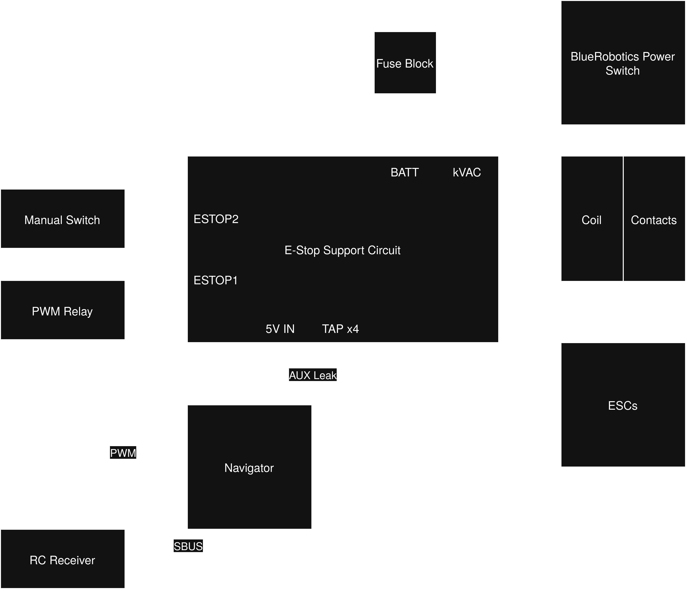
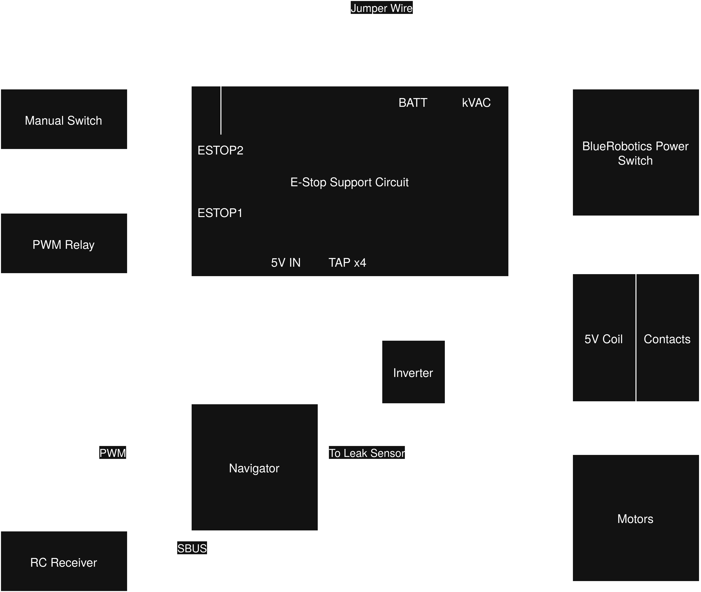

# Emergency-Stop Support Circuit
Driver Circuit for a Kilovac EV200 Contactor. Takes two switch inputs, expected to run at 5V with low current.
Theoretically, this can accept any relay or contactor with sufficiently high coil voltage, matched to the battery input, and has in-built back-emf suppression.

Normal Operation

5V Relay Control

Battery voltage side is not used. This is because the PROFET has a threshold voltage of 5.5V.

# Expected Operating Range

| Name            | Value     | Unit |
| --------------- | --------- | ---- |
| Battery Voltage | 12 - 16.8 | V    |
| Battery Current | ≤ 3       | A    |
| Signal Voltage  | 5         | V    |
| Signal Current  | 0 - 1     | A    |
| Tap Voltage     | 3.3       | V    |
| Tap Current     | 1.5       | A    |
| Sense Resistor Voltage | 0.33 | V |
| Sense Resistor Voltage (Fault) | 5.2 | V |

# [BTS6163D PROFET](https://www.infineon.com/assets/row/public/documents/10/49/infineon-bts6163d-ds-en.pdf?fileId=5546d4625a888733015aa3da01a1101e)
This circuit is primarily based on the BTS6163 PROFET, which behaves like a P-type MOSFET.
It is chosen due to the fault protection capabilities - it will fail open.

## Sense Resistor
There is a 1 kOhm resistor on the right side of the board that indicates whether the BTS6163D PROFET is in a fault condition.
Fault conditions generally include: Short circuit, overtemperature, overload.

# Opto-isolation
The 5V Signal side (left) is opto-isolated from the Battery Voltage side (right).
Opto-coupler was chosen over a MOSFET such that the 5V side can control the higher voltage side without a risk of shorting battery voltage (16.8V) to the 5V rail.

# Split ground planes
If separate power sources are used for 5V and Battery, both sides will be totally decoupled.
This reduces electromagnetic interference - but is not important in this circuit, as it does not work with sensitive signals.
