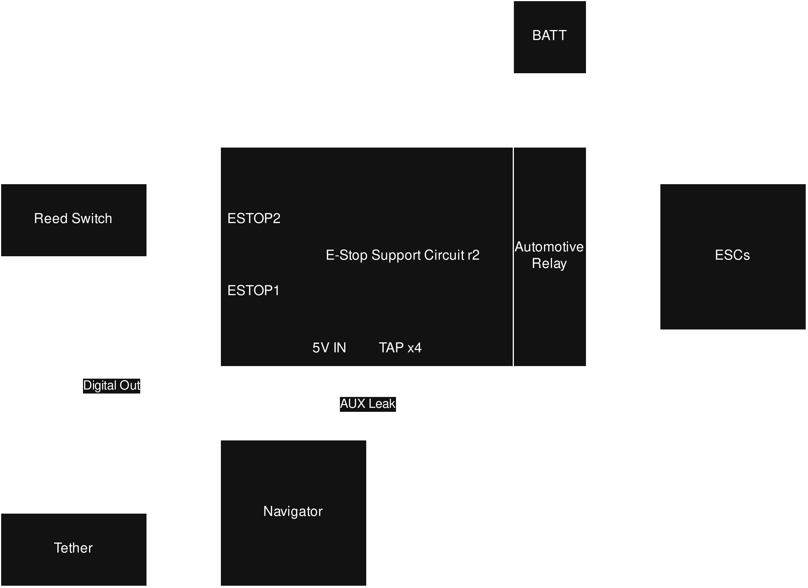

# Emergency-Stop Support Circuit
Circuit using an automotive relay to control 80A of current through 2 inputs:
- GPIO signal (2.7-5V)
- Switch (Preferably Reed Switch)

# Expected Operating Range

| Name            | Value     | Unit |
| --------------- | --------- | ---- |
| Battery Voltage | 12 - 16.8 | V    |
| Battery Current | ≤ 80      | A    |
| Signal Voltage  | 2.2 - 5   | V    |
| Signal Current  | 0 - 1     | A    |
| Tap Voltage     | 3.3       | V    |
| Tap Current     | 1.5       | A    |
| Sense Resistor Voltage | 0.33 | V |
| Sense Resistor Voltage (Fault) | 5.2 | V |

# [BTS6163D PROFET](https://www.infineon.com/assets/row/public/documents/10/49/infineon-bts6163d-ds-en.pdf?fileId=5546d4625a888733015aa3da01a1101e)
This circuit is primarily based on the BTS6163 PROFET, which behaves like a P-type MOSFET.
It is chosen due to the fault protection capabilities - it will fail open.

Somewhat overkill for this case - the automotive relay should not draw any more than 0.5 mA.

## Sense Resistor
There is a 1 kOhm resistor on the right side of the board that indicates whether the BTS6163D PROFET is in a fault condition.
Fault conditions generally include: Short circuit, overtemperature, overload.

# Opto-isolation
The 5V Signal side (left) is opto-isolated from the Battery Voltage side (right).
Opto-coupler was chosen over a MOSFET such that the 5V side can control the higher voltage side without a risk of shorting battery voltage (16.8V) to the 5V rail.

# Split ground planes
If separate power sources are used for 5V and Battery, both sides will be totally decoupled.
This reduces electromagnetic interference - but is not important in this circuit, as it does not work with sensitive signals.

# Order Parameters
Material: FR-4
Layers: 4
Copper Weight: 2 oz

# Recommended Wiring

